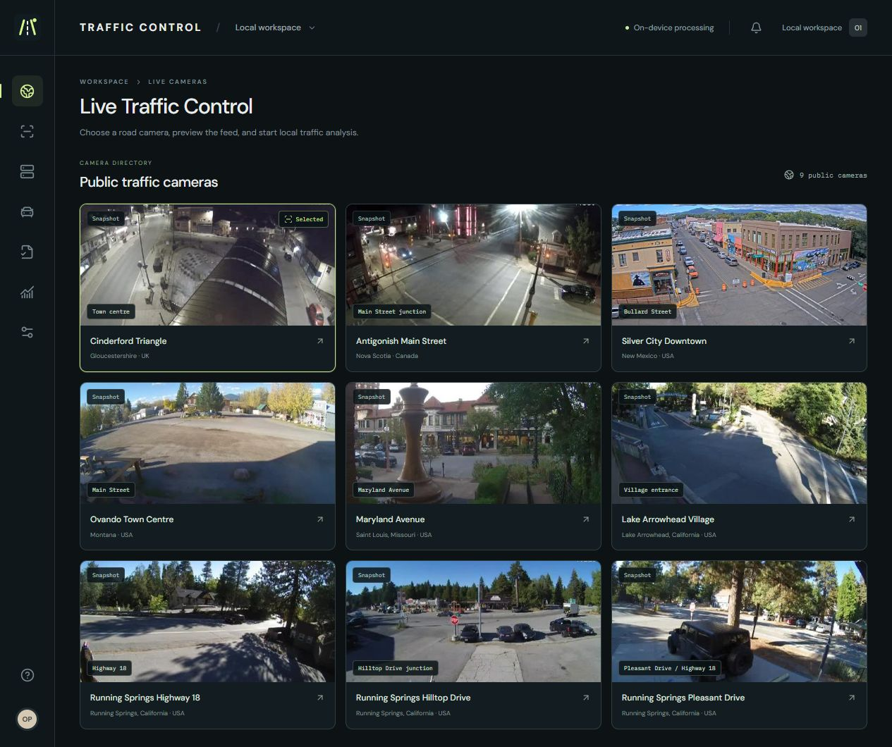
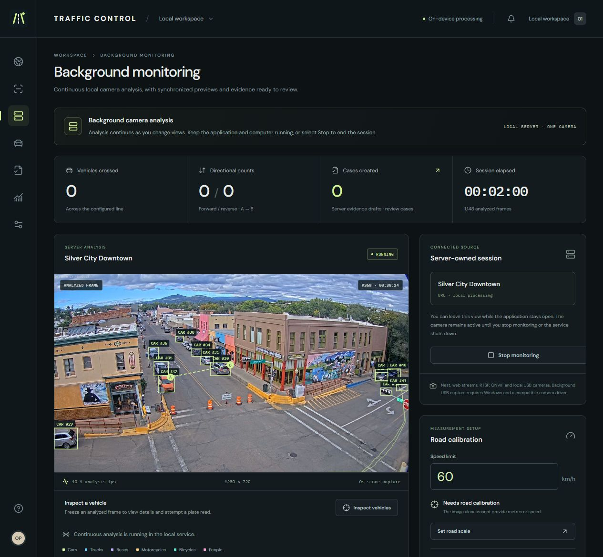

<div align="center">
  
  <h1>Traffic Control</h1>
  <p>Open Sourced Traffic Control &amp; Analytics system</p>
  <p>Vehicle tracking, traffic counts, calibrated speed measurement, and evidence review. On your computer.</p>
  <p><a href="https://github.com/mf-enterprise/open-sourced-traffic-control-analytics-system/releases/latest">Download for Windows</a> · <a href="docs/development.md">Build from source</a> · <a href="docs/measurement.md">How measurement works</a></p>
</div>



## What it does

- **Live Traffic Control:** a directory of nine selectable public road cameras, including Cinderford, with previews and one-click analysis.
- **Your own cameras:** Windows USB, RTSP/RTSPS, ONVIF, HTTP video, and public Nest links. Uploaded video works in the overview.
- **Local analysis:** vehicle classes, persistent track IDs, direction, crossing counts, and overlays.
- **Speed measurement:** measured road calibration, configurable limits, km/h or mph, and automatic above-limit case drafts.
- **Evidence review:** captured images, SHA-256 hashes, reproducible measurement traces, plate-text suggestions, and CSV/JSON or printable exports.
- **Saved sessions:** counts and settings retained in local SQLite storage.

The background monitor analyzes one camera at a time. Public feeds depend on their operators; the app shows connection failures and lets you retry.



Actual analysis of the [Silver City public feed](https://livefromsilver.com/). The road scale is unset, so no speed is displayed.

## Download

1. Download the Windows x64 ZIP from [Releases](https://github.com/mf-enterprise/open-sourced-traffic-control-analytics-system/releases/latest).
2. Extract the whole ZIP and open **Traffic Control.exe**.
3. Allow the first launch to finish downloading and verifying the video engine. Detection models are included.
4. Choose a live camera and select **Analyze camera**, or connect your own camera in **Background monitoring**.

Windows 10/11 x64. Current builds are unsigned. An internet connection is needed for first setup and public streams. CPU inference is available; compatible Windows graphics hardware can use DirectML. Throughput depends on the computer and video source.

## Start counting

Select **Set counting line**, place the line across the traffic path, and save. Counts start from observed crossings. Configure the line separately for each viewpoint.

For speed, open calibration and supply measured ground dimensions. **With video alone and no reliable distance scale, speed remains unavailable.** Camera compatibility does not make a device a calibrated radar. Plate suggestions need review, and ticket exports are drafts—not issued penalties. See [measurement limits](docs/measurement.md).

## Develop

Requires Node.js 22.13 or newer.

```sh
npm ci
npm run dev
```

```sh
npm test
npm run build
npm run desktop:build
```

The first development build downloads and verifies the models. See [development and contribution notes](docs/development.md) for the runtime layout and packaging.

## License and sources

Application code is [MIT licensed](LICENSE). Models, runtimes, and other dependencies retain their own licenses; see [third-party notices](THIRD_PARTY_NOTICES.txt). FFmpeg is fetched separately from its upstream release on first desktop launch.

Live video belongs to its camera operators. Each directory entry links to its source. The project is not affiliated with those operators or a traffic-enforcement authority.
